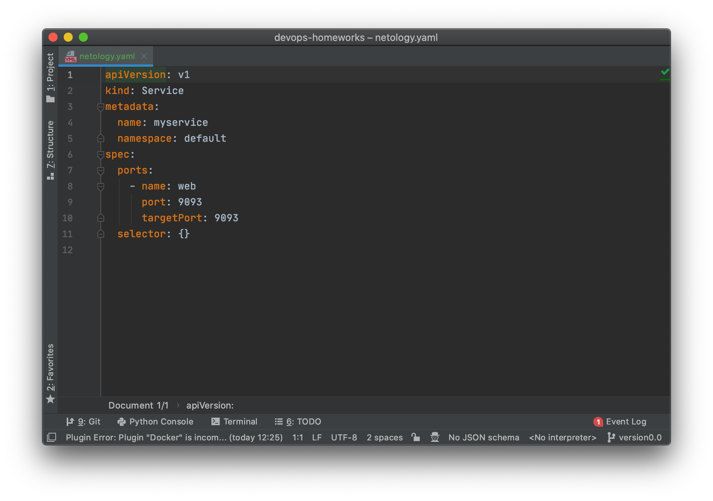
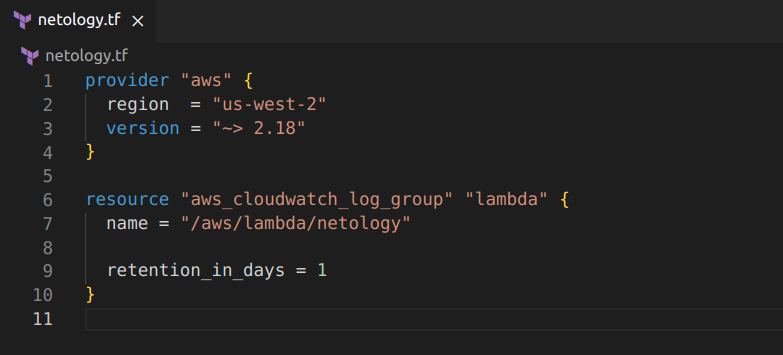
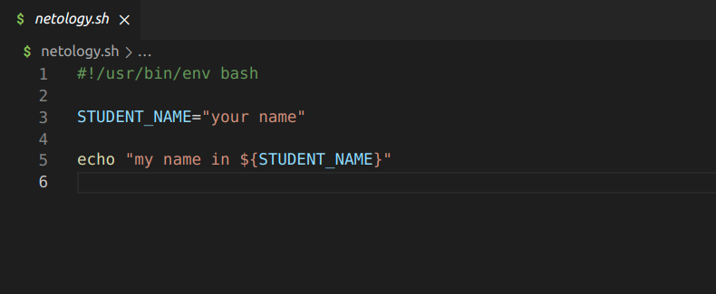
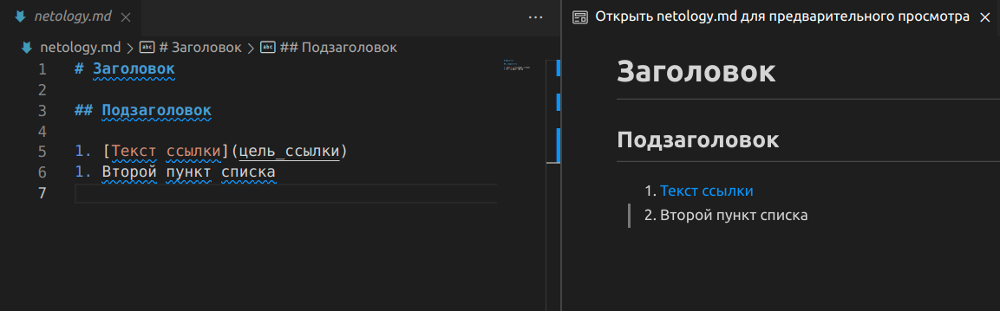
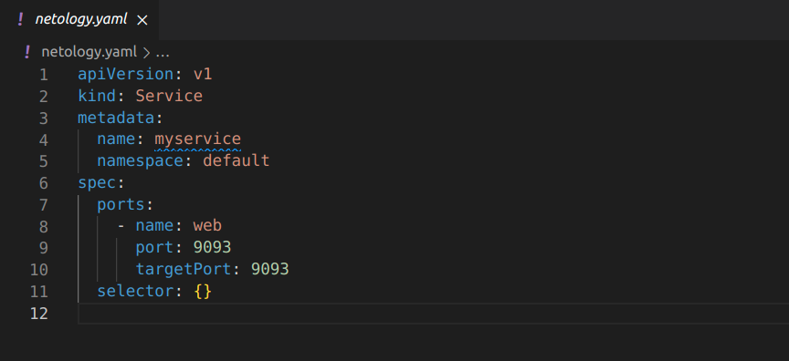
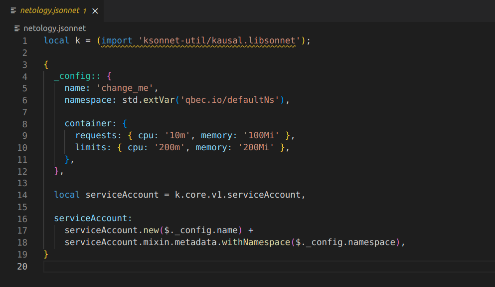

# Роль DevOps-инженера в разработке программного обеспечения. Привалихин Владимир.

## Задание 1. Подготовка рабочей среды

Вы пришли на новое место работы или приобрели новый компьютер. Сначала надо настроить окружение для дальнейшей работы. 

**Что нужно сделать**

**Шаг 1.** Установить [PyCharm Community Edition](https://www.jetbrains.com/ru-ru/pycharm/download/). Это бесплатная версия IDE.   В качестве альтернативы можно установить [Visual Studio Code](https://code.visualstudio.com/Download) и дальнейшие шаги проделать в нём. Так вы сможете выбрать более удобный инструмент для себя.

Дальше для примера будут даны скриншоты из PyCharm.

**Шаг 2.** Установить плагины:

* Terraform.
* MarkDown.
* Yaml или Ansible Support.
* Jsonnet.
   
**Шаг 3.** Склонировать текущий репозиторий (команда `git clone`) или просто создать файлы для проверки плагинов:

* [netology.tf](netology.tf) — Terraform;
* [netology.sh](netology.sh) — Bash;
* [netology.md](netology.md) — Markdown; 
* [netology.yaml](netology.yaml) — YAML;
* [netology.jsonnet](netology.jsonnet) — Jsonnet.

**Шаг 4**. Убедитесь, что работает подсветка синтаксиса. Файлы должны выглядеть так:

* Terraform: 
* Bash: 
* Markdown: 
* Yaml: 
* Jsonnet: 

*В качестве выполненного задания загрузите скриншоты установленной IDE с плагинами в файле README.md собственного репозитория в GitHub или в Google Doc.*

----

## Решение 1

* Terraform:
  

* Bash:
  

* Markdown:
  

* Yaml:
  

* Jsonnet:
  

----

## Задание 2. Описание жизненного цикла задачи (разработки нового функционала)

Чтобы лучше понимать предназначение инструментов, с которыми вам предстоит работать, составим схему жизненного цикла задачи в идеальном для вас случае.

### Описание истории

Представьте, что вы работаете в стартапе, который запустил интернет-магазин. Он достаточно успешно развивался, и пришло время налаживать процессы: у вас стало больше конечных клиентов, менеджеров и разработчиков.

Сейчас от клиентов вам приходят задачи, связанные с разработкой нового функционала. Задач много, и все они требуют выкладки на тестовые среды, одобрения тестировщика, проверки менеджером перед показом клиенту. В некоторых случаях вам будет необходим откат изменений. 

### Решение задачи

Вам нужно описать процесс решения задачи в соответствии с жизненным циклом разработки программного обеспечения. Использование конкретного метода разработки необязательно. 

Для решения главное — прописать по пунктам шаги решения задачи (релизации в конечный результат) с участием менеджера, разработчика (или команды разработчиков), тестировщика (или команды тестировщиков) и себя как DevOps-инженера. 

*Ответ пришлите в свободной форме.*

----

## Решение

sdfsdfsdfsdfs
